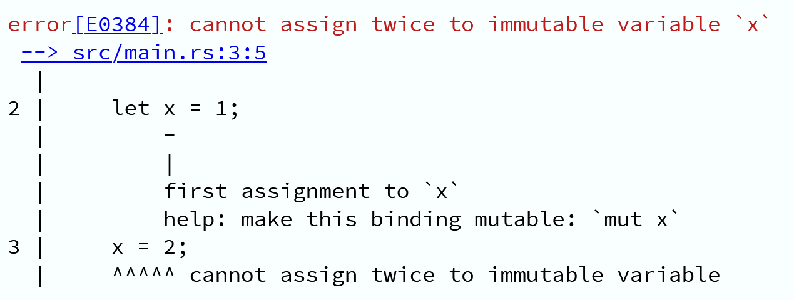

<!-- _paginate: false -->
<!-- _footer: "" -->

# Intoduction to Rust

---

## 今回の発表の目的

- Rust とそのエコシステムの魅力をわかってもらう
  - Rust がよいものであることはなんとなく知ってると思うので、
    Rust を使ってみたいって思ってもらえるようなことを話したい
- Rust の始め方を覚えてもらって暇になったときに
  いつでも Rust を始めてもらえるようにする
- ぼくの二個目の発表へのつなぎ

---

## Rust ってなに

（想定知識）

- プログラミング言語
  - と、その処理系
- 人気っぽい
  - なんか調べれば出てきそう
- 安全性・並行性を売りにしていることで有名っぽい
  - なんか調べれば出てきそう
- 学習が大変なことで有名っぽい
  - なんか調べれば出てきそう

---

## なぜ Rust か？

---

<!-- _footer: "" -->

---

## なぜRustか？

- パフォーマンス
  - はやい
- 信頼性
  - きびしい

---

## なぜRustか？

- パフォーマンス
  - （なにもしなくても）はやい
- 信頼性
  - （なにもしなくても）きびしい
* パフォーマンスと信頼性は有名な話なので割愛！ｗ
- **生産性**
  - たのしい
  * これの話をします

---

## 生産性

> Rustには優れたドキュメント、有用なエラーメッセージを備えた使いやすいコンパイラ、および統合されたパッケージマネージャとビルドツール、多数のエディタに対応するスマートな自動補完と型検査機能、自動フォーマッタといった一流のツール群が数多く揃っています。

* そんなんどんな言語にもあるやん…？と思うかもしれませんが！！！（大声）

---

## 優れたドキュメント

- がある
  - 公式が入門のための教材（後述）や教科書（後述）を用意するなど
    ドキュメントの拡充に非常に意欲的
  - なんでも安易にドキュメント化する文化がある
    - The * Book
    - チュートリアルからコンパイラの内部構造まで…
- を作れる
  - `cargo doc`
  - これが簡単なおかげでエコシステム全体でドキュメントのクオリティが高い
  - あと型がついてるからそれだけでドキュメントとして成立しちゃったり

---

<!-- _footer: "" -->

---

## 有用なエラーメッセージを備えた使いやすいコンパイラ

- 丁寧もはや直し方を教えてくれる

---

## 統合されたパッケージマネージャとビルドツール

- `cargo` というビルドツールが標準で用意されていて、非常に優秀
- 何が優秀かって難しいけどとにかくやるだけなんですよね
- 依存関係の解決が高速だし Dependency Hell も発生しない
  - 参考: How Rust Solved Dependency Hell - https://stephencoakley.com/2019/04/24/how-rust-solved-dependency-hell
- SemVer をみんな使っているので幸せ

---

## 多数のエディタに対応するスマートな自動補完と型検査機能、自動フォーマッタ

- まあこれは LSP 実装があるってだけなのでそれはそうって感じですね✌

---

<!-- _footer: "" -->
## ほかにも… 1

- Clippy
  - コード規約とか文化とかを理解するのには時間がかかるのでしんどいが
    Clippy はそういうのを自動で見つけ出して指摘・たまに自動修正してくれる
- コード規約を積極的に公式の側で決めてくれるので考えることが少なくて楽
  - これとか https://rust-lang.github.io/api-guidelines/
  - 
  - > With a few exceptions, the get_ prefix is not used for getters in Rust code. The get naming is used only when there is a single and obvious thing that could reasonably be gotten by a getter.

---

## ほかにも… 2

- 公式のコンパイラバージョン管理ツール・インストーラ Rustup
  - https://rustup.rs/
  - まずインストールでつまずくことはない
  - 別バージョンのコンパイラに一瞬だけ切り替えるとかも簡単
- 完成物の配布が楽
  - LLVM がバックエンドなので対応アーキテクチャが豊富
  - クロスコンパイルがコンパイルオプションだけで完結
  - シングルバイナリもやるだけ
  - C で書かれたライブラリを使ったりしていると面倒だけど
    対応策はたくさんあるしそういうのを pure Rust で
    置き換えた実装がだいたい存在するので困ることはほとんどない

---

## OK

- Rust のエコシステムは心地がいいので
  書いてて非本質な部分で台パンしたくなることが少ないよ
- おれがエコシステムが微妙な文化圏にばかり居ただけかもしれんが
- 一番魅力が詰まってるのは公式サイトなんで読んでくれや
  - https://www.rust-lang.org/

---

<!-- _footer: "" -->

---

## （補足）逆にRustで書かないかなってやつ

- スクリプティング
  - まず一ファイルで実行したりしない
- おもしろ型ハック
  - Haskell（GHC）みたいな奇想天外な型レベル機能があるわけじゃない
- Web フロントエンド
  - なんかそういうのはあるけどメインストリームとしては高負荷な計算を WebAssembly に押し付けようということであってフロントエンド全体を Rust で書こうというきもちはそんなにないらしいです

---

# Rustを始めよう！

---

<!-- _footer: "" -->

---

## Rustlings

- https://github.com/rust-lang/rustlings/
  - 実際にエラーを修正していく形で Rust を読み書きできるようになる教材
  - とにかく手を動かし始められるしおすすめ
  - オンラインでも:
    https://gitpod.io/#https://github.com/rust-lang/rustlings

---

<!-- _footer: "" -->

---

<!-- _footer: "" -->

---

<!-- _footer: "" -->

---

## そのほかの教材

- The Rust Programming Language - https://doc.rust-lang.org/book/
  - 日本語版: https://doc.rust-jp.rs/book/second-edition/
  - Rust の教科書; 順当に学ぶならこれ
- Rust by Example - https://doc.rust-lang.org/stable/rust-by-example/
  - 日本語版: https://doc.rust-jp.rs/rust-by-example-ja/
  - 日本語で一番ハードルが低いのはこれかも？
- κeen『実践 Rust 入門 \[言語仕様から開発手法まで\]』技術評論社, 2019
  - 紙の本

---

## 書いてて使えそうな資料とか

- The Rust Standard Library - https://doc.rust-lang.org/std/
  - これブックマークしておくとよし
- https://lib.rs/
  - crates.io よりクレートが探しやすいかも
- Rust Playground - https://play.rust-lang.org/
- Rust Language Cheat Sheet - https://cheats.rs/
- Rust API Guidelines - https://rust-lang.github.io/api-guidelines/
- Rust Cookbook - https://rust-lang-nursery.github.io/rust-cookbook/

---

## Q&A

---

<!-- _paginate: false -->
<!-- _footer: presented by coord_e <<me@coord-e.com>> -->

# ありがとうございました
